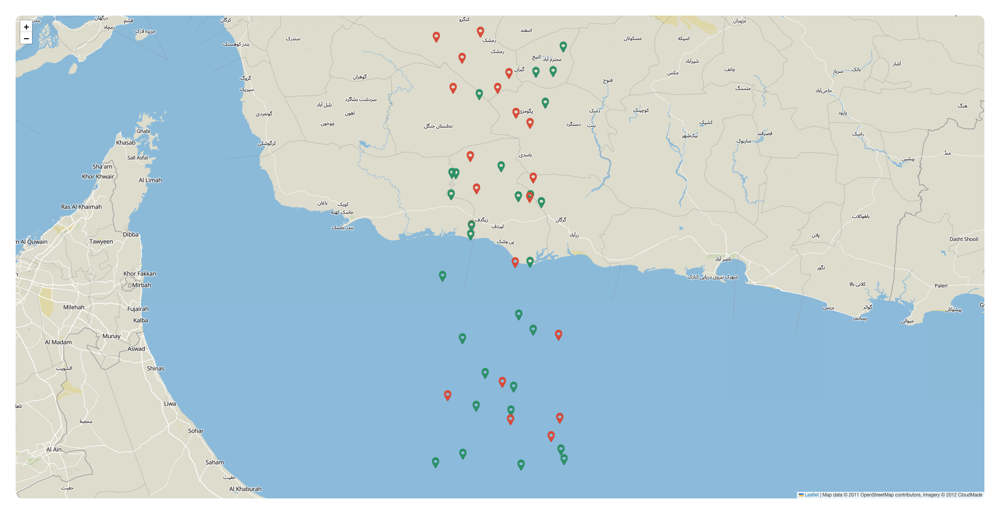
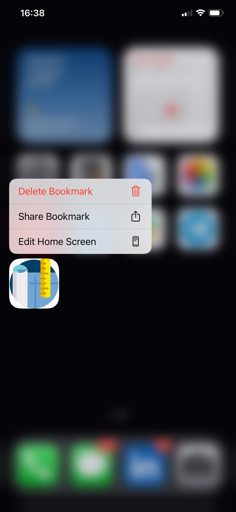
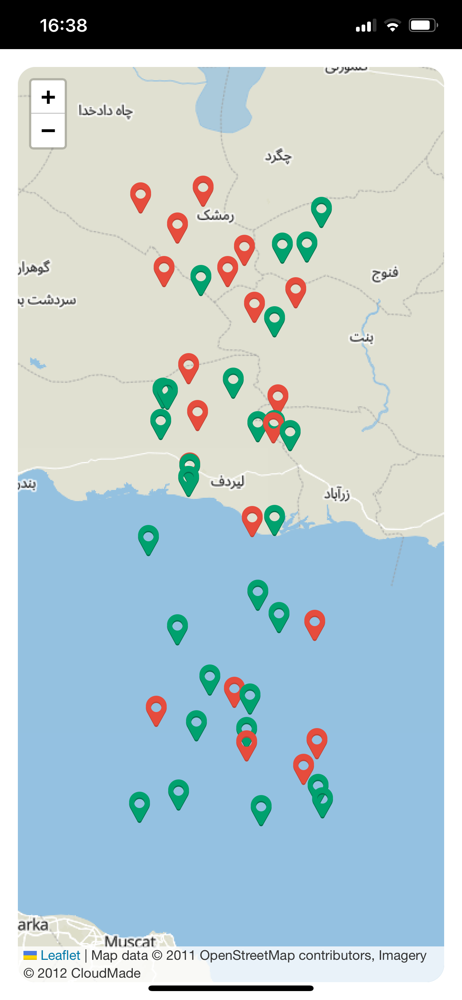

# OpenStreetMap Mini-App

## Description

This project is a single-page front-end application built using React, TypeScript, and Tailwind CSS. It utilizes OpenStreetMap for map display and OpenLayers for rendering map points. The application includes zoom controls, point status management, offline functionality, and PWA support for iOS and Android. The focus of this task is to demonstrate a structured technical approach, responsive design, and an efficient architecture.

---

## Demo

You can access the live demo here: [https://prosightdev.netlify.app/](https://prosightdev.netlify.app/)

The demo allows you to install the Progressive Web App (PWA) on supported devices.

GitHub Repository: [https://github.com/stwr8/prosightdev_test_project](https://github.com/stwr8/prosightdev_test_project)

---

## Features

- **Responsive Design**: Adaptive layout for both mobile and desktop views.
- **Zoom In/Out Controls**: Visible on both mobile and desktop versions.
- **Point Markers**: Display map points from JSON data, with status indicated by color.
- **Point Interaction**: Click on points to view and edit comments or update status.
- **Offline Mode**: Works offline, allowing users to refresh the page and preserve status and comments.
- **PWA Support**: Progressive Web App functionality for iOS and Android.
- **End-to-End Testing (in progress)**: Includes basic e2e testing functionality.

---

## Screenshots

### Website



### PWA




---

## Installation

### Clone the Repository

```bash
git clone https://github.com/stwr8/prosightdev_test_project.git
cd prosightdev_test_project
```

### Start the Project

```bash
yarn
yarn dev
```

### Build the Project

```bash
yarn
yarn build
```
